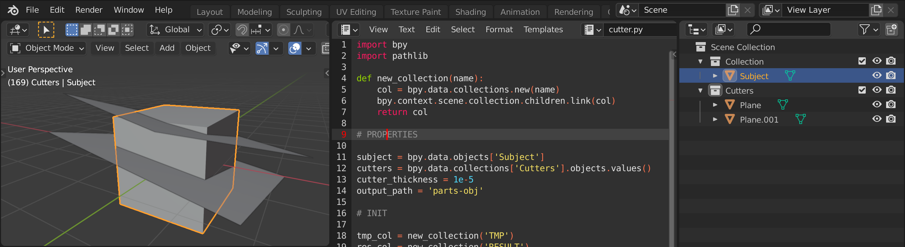

# BLENDER SCRIPTS

Everyday helpers for digital production at [Kunstbetrieb](https://www.kunstbetrieb.ch)

## Usage

Copy the script into your blendfile and make necessary changes to the properties section

## Cutter

| Variable         | Definition                                                         |
| ---------------- | ------------------------------------------------------------------ |
| subject          | a reference to the object you want to cut                          |
| cutters          | a reference to the collection of cutting polygons                  |
| cutter_thickness | the thickness of the cutters                                       |
| output_path      | string containing the output directory relative to your blend file |
